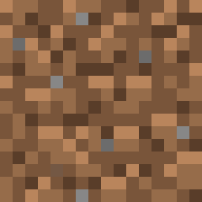
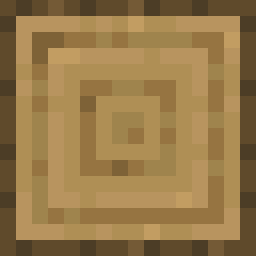
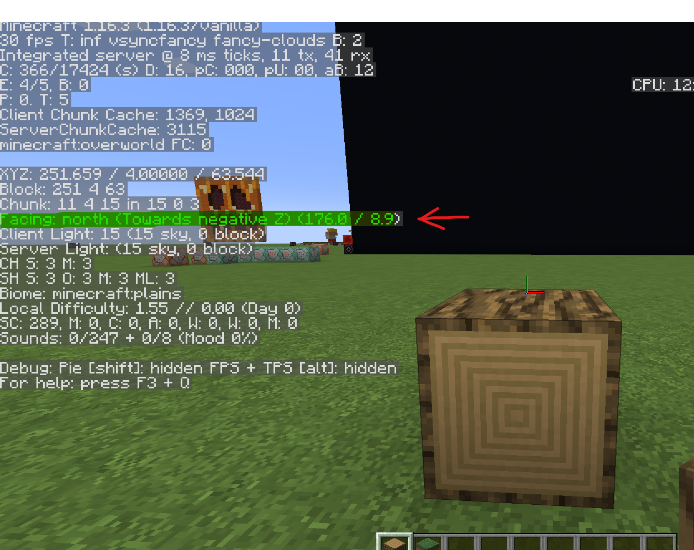
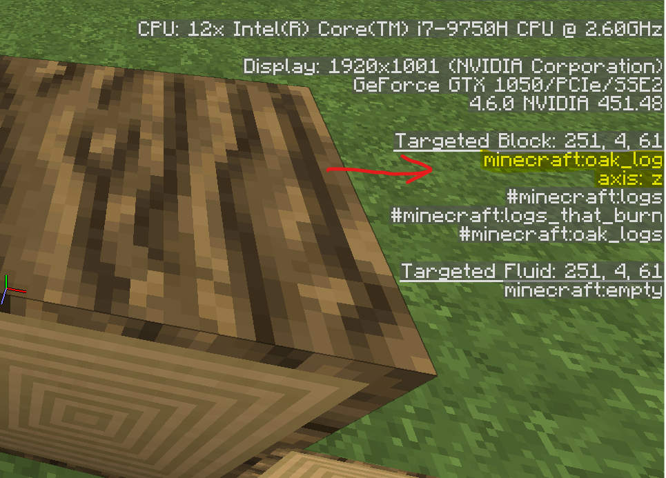

# minecraft-movie-player

A command line program that generates a datapack that plays videos in vanilla Minecraft

The goal of this program is to take a video file and convert its frames into structure block files so that it can be played inside a Minecraft world through the use of a datapack and a resourcepack

## Getting started

**Prerequisites**

 - [Python >= 3.8](https://www.python.org/downloads/) 
 - [ffmpeg](https://ffmpeg.org/download.html) or [libav](https://libav.org/download/)
 - Minecraft java edition 1.16 (May work on earlier versions but is untested)

Make sure both python and ffmpeg/libav are present in your system's PATH environment variable

**Installation**

the installation can be done through a command line terminal using [pip](https://pypi.org/project/pip/)

    $ python -m pip install minecraft-movie-player

**Basic usage**

The program can be called from a command line with

    $ mc-movie

or, alternatively, with

    $ python -m minecraft_movie_player

The easiest way to generate the necessary files is through the sub command `all` provided by the cli, like so:
 
    $ mc-movie all OUTPUT_FOLDER -v VIDEO
   
OUTPUT_FOLDER should be replaced with the path to a (preferably empty) folder where all the generated files will be saved.
VIDEO should be replaced with the path to the video that is to be played inside Minecraft

Once the program begins, it can take from a few minutes to a few hours for it to finish, depending on the length of the video as well as the performance of your processor.

Throughout this process, hundreds (or even thousands) of files will be dumped inside the output folder, try not to mess with any of them and don't worry about the mess, by the end all that will be left in there is a single folder and a zip file.

If the process in interrupted, it can be resumed later simply by providing the path to the output folder that was being used, provided the files within it are still intact.

    $ mc-movie all SAME_OUTPUT_FOLDER

**Getting the video inside Minecraft**

Once the program is done, go inside the output folder, where you will find a folder named `player` and a zip file named `resources.zip`. Go into Minecraft, select the world of your choice, click the button `Edit` on the bottom left and then the button `Open world folder`. Copy `resources.zip` to this folder, then head inside the folder named `datapacks` and copy the folder `player` to it.

After all that is done, open your Minecraft world and pick the location for the screen's bottom left corner, stand there, open the chat (default key is `t`), then send

    /function player:setup_video

and

    /function player:setup_audio

Finally, when you wish to start the video, send

    /function player:restart
   
That's it! If everything went accordingly, your video should be playing inside vanilla Minecraft.
Additionally, the following commands should be available to pause/play the video:

    /funtcion player:pause
    /function player:play

## Complete usage instructions

**the `all` subcommand**

As explained above, this command easily generates all the required files without much hassle.

Required positional arguments:
- `path_to_output_folder`: the path to the folder where all the generated files will be dumped. Additionally, a `progress.txt` file will be created inside the folder, it helps the program pick up where it left off in case it is interrupted. If the file is present, all provided optional arguments will be ignored in favor of the values present inside `progress.txt`. If the file is not present, the argument `-v`/`--video` becomes obligatory.

Optional arguments:
- `-v` or `--video`: the path to the video that is to be used as a base for generating all the required files. The video's frames will be converted into structure block (nbt) files. The audio will be split into 60 seconds-long segments and saved as vorbis encoded .ogg files. If the video contains more than one audio track, the one marked as default within the file will be used. If the video has no sound, all of the steps pertaining to audio playback will be skipped.
- `d` or `--datapack-name`: the name that will be assigned to the generated datapack, it must contain only legal characters, as explained in the [wiki](https://minecraft.gamepedia.com/Tutorials/Creating_a_data_pack#Legal_characters), and in this case, be no longer than 13 characters.
- `p` or `--palette`: the path to a custom block palette file. More information about this file can be found below.
- `t` or `--ticks-per-frame`: an integer above 0 that states the amount of game ticks in between every video frame. The lower this number, the higher the framerate. The lowest possible number, 1, yields a framerate of 20 fps, since Minecraft runs at 20 ticks per second. The default is 2.
- `x` or `--width`: the with in blocks of the structures that will be generated. Defaults to 75 if no width or height are given.
- `y` or `--height`: the height in blocks of the structure that will be generated.

Note: if only one of `-x`/`width` or `-y`/`--height` is provided, the other one will be calculated automatically as to preserve the aspect ratio.

- `-m` or `--adjust-mode`: can be one of either `fit` or `fill`. If both `-x`/`--width` and `-y`/`--height` are specified and their aspect ratio differs from that of the original video, this option tells the program how it should resize every frame. `fit` makes it so that black bars are added to the sides or to the top/bottom of the image in order to adjust it to the given dimensions. `fill` makes it so that the image is cropped in order to adjust to the given dimensions. This option is ignored unless both dimensions are specified.

The `all` subcommand described above is merely a shortcut for a set of more complicated commands that are used to generate all of the individual parts of the datapack and resource pack. These commands can be used if more advanced options are required or if only one of the many parts needs to be generated, instead of all of them.

**The `video` subcommand**

This command takes the frames of a video and converts them to .nbt files that can be used to place structures inside minecraft. One file will be generated per frame.

Required positional arguments:

- `path_to_video`: the path to the video whose frames are to be converted to nbt files.
- `path_to_output_folder`: the path to the folder where all the nbt files will be dumped.

Optional arguments:

- `-p` or `--paeltte`: the path to a custom block palette file. More information about this file can be found below.
- `-n` or `--name-prefix`: the name that is to be prefixed to every generated file. For instance, the option `-n foo_` yields files such as `foo_0.nbt`, `foo_1.nbt`, etc.
- `-t` or `--ticks-per-frame`: an integer above 0 that states the amount of game ticks in between every video frame. The lower this number, the higher the framerate. The lowest possible number, 1, yields a framerate of 20 fps, since Minecraft runs at 20 ticks per second. The default is 2.
- `x` or `--width`: the with in blocks of the structures that will be generated. Defaults to 75 if no width or height are given.
- `y` or `--height`: the height in blocks of the structure that will be generated.

Note: if only one of `-x`/`width` or `-y`/`--height` is provided, the other one will be calculated automatically as to preserve the aspect ratio.

- `-m` or `--adjust-mode`: can be one of either `fit` or `fill`. If both `-x`/`--width` and `-y`/`--height` are specified and their aspect ratio differs from that of the original video, this option tells the program how it should resize every frame. `fit` makes it so that black bars are added to the sides or to the top/bottom of the image in order to adjust it to the given dimensions. `fill` makes it so that the image is cropped in order to adjust to the given dimensions. This option is ignored unless both dimensions are specified.
- `-u` or `--unoptimized`: by default, every generated frame contains only the blocks that differ from the previous frame in an attempt to save resources. If this argument is present, the optimization will be disabled.
- `-s` or `--subprocesses`: in order to speed up the generation of frames, the work is done in parallel by different subprocesses. This option specifies the amount of subprocesses that are to be used to divide the workload. Defaults to the amount of cores on your CPU.

**The `resourcepack audio` subcommand**

This subcommand takes the audio track from a video or audio file and splits it up into chunks that are saved as vorbis encoded ogg files. These files can be used inside a resourcepack and played with Minecraft's `/playsound` command.

Required positional arguments:

- `path_to_audio`: the path to the file that is to be split into chunks and converted
- `path_to_output_folder`: the path to the folder where all the files will be dumped

Optional arguments:

- `-s` or `--split-size`: the duration in seconds of of every generated audio chunk. Default is 60.
- `-p` or `--name-prefix`: the name that is to be prefixed to every generated audio file. For instance, the option `-p bar_` yields files such as `bar_0.ogg`, `bar_1.ogg`, etc.

**The `resourcepack json` subcommand**

In order for the audio files to be recognized by a resourcepack, and therefor by the `/playsound` command, a `sounds.json` file containing all the audio filenames must be generated. That is the purpose of this subcommand.

Required positional arguments:

- `output_folder`: the path to the folder where the `sounds.json` file is to be dumped.
- `amount_of_sound_files`: the amount of sound files that should be included inside `sounds.json`.

Optional arguments:

- `-p` or `--name_prefix`: the name that was used as a prefix for the audio files.
- `-f` or `--subfolder-name`: the name of the subfolder inside the resourcepack where the game will look for the audio files.
- `-m` or `--merge`: if another `sounds.json` file is found in the output folder and this argument is present, the contents of both `sounds.json` files will be merged. Otherwise, the old `sounds.json` file will be overwritten.

**The `functions video` subcommand**

In order for the structures to be placed sequentially in the world, producing the video, a series of functions is required and can be generated using this subcommand.

Required positional arguments:

-   `output_folder`: the folder where all the generated mcfunction files are to be dumped.
- `amount_of_frames`: the amount of frames (nbt files) that make up the video.

Optional arguments:

- `-d` or `-datapack-name`: the name that will be assigned to the generated datapack, it must contain only legal characters, as explained in the [wiki](https://minecraft.gamepedia.com/Tutorials/Creating_a_data_pack#Legal_characters), and in this case, be no longer than 13 characters. It must also remain consistent across the different generated files.
- `-p` or `--name-prefix`: the name that is prefixed to every frame (nbt file). For instance, if we had files such as `foo_0.nbt`, `foo_1.nbt`, etc. the prefix `foo_` should be given.
- `-m` or `--max-commands`: the program will have to generate at least one Minecraft `execute` command for every frame. Keeping all of these commands in a single file will cause the game to attempt to run all of them every tick. It is however possible to mitigate this by keeping fewer commands in every file. This option specifies the maximum amount of commands that will be allowed per file.
- `-t` or `--ticks-per-frame`: the amount of game ticks in between every frame. If this number does not match the one the frames were generated with, the video will be sped up or slowed down.

## How it works

The most important part of the program is that which analyses an image pixel by pixel and finds which Minecraft block is the closest in color. In order to so, the program requires a list of of Minecraft blocks and their average RGB value, this list is known as a palette. The larger the palette, the better the image

**How to create a palette**

The script is able to analyze a folder containing Minecraft texture images (obtained by extracting .minecraft/versions/[version number]/[version number].jar with any tool such as WinRAR or 7Zip) in order to find their average colors and put them on a file, the palette. However, average color is not all the information the program needs, it also has to know which block IDs go with which colors, and in some cases some NBT data indicating the direction a block is facing.

This information is stored in a file formatted with tab separated values called the index, which tells the script the filenames of different Minecraft blocks, their block IDs and, optionally, the NBT data required to make the block face the right direction.

For example, the following is the file containing the texture for dirt:

The name of this image is dirt.png.

This block is simple enough, as its filename is the same as its block ID and looks the same on all sides. Its corresponding entry on the index would look something like this:

    dirt.png dirt

However, it is not so simple for other blocks. Consider the following image:

The name of this image is oak_log_top.png, however its block ID is simply oak_log. Moreover, this block is placed upright by default, meaning we need to add information about its orientation to be able to see the top when standing in front of it. More precisely, the script wants the information required to make its blocks face north.

So, what do we do? We go into Minecraft an place down an oak log facing north with the help of the debug menu (f3), like so:

Then, we point at the block and look at the right of the debug menu, there, we will find its block ID, as well as information regarding its orientation

The first highlighted line, minecraft:oak_log, is the block ID, the second, axis: z, is the information we need about the orientation, meaning the index would now look like this:

  

    dirt.png dirt
    
    oak_log_top.png oak_log {axis:z}

Keep in mind that two entries may share the same block ID, so long as they point at different images, for instance, the following entries are fine:

  

    dirt.png dirt
    
    oak_log_top.png oak_log {axis:z}
    
    oak_log.png oak_log {axis:y}

  

If we were to add, say, furnaces into the mix, the index would now look like this:

  

    dirt.png dirt
    
    oak_log_top.png oak_log {axis:z}
    
    oak_log.png oak_log {axis:y}
    
    furnace_front.png furnace {facing:north}
    
    furnace_side.png furnace {facing:east}
    
    furnace_back.png furnace {facing:south}

  

Once the index is filled to your own satisfaction, it can be fed into the script to generate the palette

This project comes with its own index and palette, however, they may be incomplete or outdated, so it is encouraged to make a pull request if you have indexed any new blocks.

It is recommended that you don't use any blocks that aren't full blocks, can't stand on their own, would cause light updates (transparent blocks or light emitting blocks), can not be seen at a distance, or would behave in destructive ways (water, lava, TNT)

Feel free to use these blocks at your own risk, but I will be declining any pull requests containing them.
