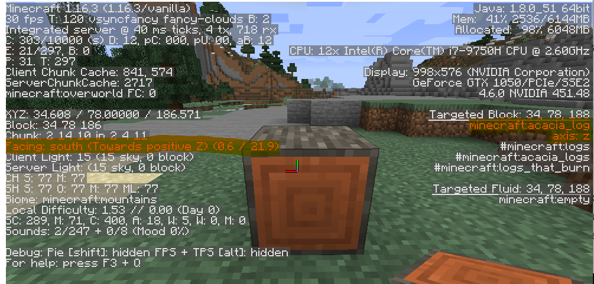

# minecraft-movie-player

A command line program that generates a datapack that plays videos in vanilla Minecraft

The goal of this program is to take a video file and convert its frames into structure block files so that it can be played inside a Minecraft world through the use of a datapack and a resourcepack

## Quick start tutorial

**Prerequisites**

 - [Python >= 3.8](https://www.python.org/downloads/) 
 - [ffmpeg](https://ffmpeg.org/download.html) or [libav](https://libav.org/download/)
 - [Minecraft Java Edition](https://www.minecraft.net/en-us/store/minecraft-java-edition) 1.16 (May work on earlier versions but is untested)

Make sure both python and ffmpeg/libav are present in your system's PATH environment variable

**Installation**

the installation can be done through a command line terminal using [pip](https://pypi.org/project/pip/)

    $ python -m pip install minecraft-movie-player

**Basic usage**

The program can be called from a command line with

    $ mc-movie

or, alternatively, with

    $ python -m minecraft_movie_player

The easiest way to generate the necessary files is through the sub command `all` provided by the cli, like so:
 
    $ mc-movie all OUTPUT_FOLDER -v VIDEO
   
OUTPUT_FOLDER should be replaced with the path to a (preferably empty) folder where all the generated files will be saved.
VIDEO should be replaced with the path to the video that is to be played inside Minecraft

Once the program begins, it can take from a few minutes to a few hours for it to finish, depending on the length of the video as well as the performance of your processor.

Throughout this process, hundreds (or even thousands) of files will be dumped inside the output folder, try not to mess with any of them and don't worry about the mess, by the end all that will be left in there is a single folder and a zip file.

If the process in interrupted, it can be resumed later simply by providing the path to the output folder that was being used, provided the files within it are still intact.

    $ mc-movie all SAME_OUTPUT_FOLDER

**Getting the video inside Minecraft**

Once the program is done, go inside the output folder, where you will find a folder named `player` and a zip file named `resources.zip`. Go into Minecraft, select the world of your choice, click the button `Edit` on the bottom left and then the button `Open world folder`. Copy `resources.zip` to this folder, then head inside the folder named `datapacks` and copy the folder `player` to it.

After all that is done, open your Minecraft world and pick the location for the screen's bottom left corner, stand there, open the chat (default key is `t`), then send

    /function player:setup_video

and

    /function player:setup_audio

Finally, when you wish to start the video, send

    /function player:restart
   
That's it! If everything went accordingly, your video should be playing inside vanilla Minecraft.
Additionally, the following commands should be available to pause/play the video:

    /funtcion player:pause
    /function player:play

## Using a custom block palette

In order to use a custom set of blocks for the creation of the video, we will need to provide our own custom block palette. The program provides some of the tools necessary for creating this file.

The palette is a file that contains information about the blocks we wish to use and their average RGB color. The program then uses this palette to find the most appropriate block for each pixel on the video.

Creating the palette can be done through two main steps. First, we create an index file, this file lists all the blocks that are to be used in the palette, along with the filenames of their corresponding textures. Secondly, we feed this palette into the program, which will look for the specified textures, calculate their average RGB color then store them in a palette file.

In this guide, we will be creating an index file from scratch. Note however that an index file is already bundled along the program's files, so it is probably a good idea to modify it to suit your needs instead of creating one from scratch.

The first thing wee need is a folder containing all the block textures we wish to use. If we wanted to use the vanilla Minecraft textures, then we would head to [.minecraft](https://minecraft.gamepedia.com/.minecraft#Locating_.minecraft)/versions/[version number] and extract the contents of the file [version number].jar with a tool such as 7zip or WinRAR. Then, along the files we just extracted, we would locate the folder assets/minecraft/textures/block. This is the folder containing all of the block textures.

It is also possible to want to create a custom block palette to use along a resource pack, since the colors of the blocks may differ from those in the vanilla textures. Any resource pack you download should also contains the folder assets/minecraft/textures/block.

We now want to make a copy of the `block` folder and start deleting the textures for all the blocks we do not wish to include. It is a good idea to delete textures that

- **Are not full blocks**, such as doors, levers, rails, pots, flowers, anvils, etc.
- **Can never face the side**, such as the tops of ancient debris, crafting tables, beehives, etc.
- **Can not stay forever**, such as living corals, which will die, water which will flow, frosted ice, which will melt, etc.
- **Produce light**, such as glowstone, sea lanterns, etc.
- **Are transparent**, such as glass, ice, etc.
- **Can not stand on their own**, such as sand, gravel, concrete powder, etc.
- **May interact with other blocks**, such as lava, redstone, carved pumpkins, TNT, etc.
- **Produce particles**, such as wet sponges.
- **Can not be seen from a distance**, such as shulker boxes.
- **Don't belong to any actual blocks**, such as block breaking textures and debug textures.

After all that work is done, we need to make an index file. The index file is an Excel flavored csv file with the texture's filename on the first column, its corresponding block ID on the second column, and any additional nbt data required for the texture to face the side on the third column. We can generate a template for this file using the following command:

    $ mc-movie index PATH_TO_BLOCK_FOLDER PATH_TO_INDEX_FILE -f

PATH_TO_BLOCK_FOLDER is the path to the folder containing all the block textures we wish to use.
PATH_TO_INDEX_FILE is the path where we wish to save the index template

this will produce a file that looks something like this:

    acacia_log.png;acacia_log;
    acacia_log_top.png;acacia_log_top;
    acacia_planks.png;acacia_planks;
    ancient_debris_side.png;ancient_debris_side;
    andesite.png;andesite;
    [...]
    yellow_glazed_terracotta.png;yellow_glazed_terracotta;
    yellow_terracotta.png;yellow_terracotta;
    yellow_wool.png;yellow_wool;

As you can see, a lot of these lines are already as they should be, but some of them are not. Take for instance the following entry:

    acacia_log_top.png;acacia_log_top;

Minecraft has no block with ID `acacia_log_top`, as the texture in question is merely one of the sides of the acacia log, with id `acacia_log`. So we change the ID and end up up with the following:

    acacia_log.png;acacia_log;
    acacia_log_top.png;acacia_log;
    acacia_planks.png;acacia_planks;
    [...]

However, this is not enough, since we want the texture `acacia_log_top.png` to face the side, we need a way to tell Minecraft that the block should be placed on its side. To do so, we can head into Minecraft and place an acacia log with its top facing **south**, then open the debug menu (default key is `f3`), and point towards the block. On the right, we see information about the block, including its ID and its properties. We are interested in the one that says `axis: z`, since it is the one responsible for the orientation.

So we add `{'axis': 'z'}` on the third column:

    acacia_log.png;acacia_log;
    acacia_log_top.png;acacia_log;{'axis': 'z'}
    acacia_planks.png;acacia_planks;
    [...]

Something similar happens in the case of blocks such as furnaces

    [...]
    end_stone_bricks.png;end_stone_bricks;
    furnace_front.png;furnace_front;
    furnace_side.png;furnace_side;
    gold_block.png;gold_block;
    [...]

In this case, both of the IDs are wrong, it should simply be `frunace`.
Additionally, for the front to face south, the block should have the property `{'facing': 'south'}` and for the side to face south, the furnace needs to face east, west or north. Pick your poison.

    [...]
    end_stone_bricks.png;end_stone_bricks;
    furnace_front.png;furnace;{'facing': 'south'}
    furnace_side.png;furnace;{'facing': 'north'}
    gold_block.png;gold_block;
    [...]

For most blocks, the only two properties we will have to worry about are `axis` and `facing`, although there are a few exceptions such as mushroom blocks, barrels and beehives.

After we are done adding nbt data and fixing incorrect block IDs, we are practically done, all we need to do is tell the program to generate a palette based on this index using the following command

    $ mc-movie palette PATH_TO_BLOCK_FOLDER PATH_TO_PALETTE -i PATH_TO_INDEX

PATH_TO_BLOCK_FOLDER is the path to the folder containing all the block textures. Note that it doesn't matter if this folder contains any extra files, as any file not present in the index will not be considered.
PATH_TO_PALETTE is the path where we wish to save the generated palette
PATH_TO_INDEX is the path to the index file we just created.

After a few seconds, the program will have generated a palette file; we are now done. The file can used through the cli's subcommands `all` and `video` using the argument `-i PATH_TO_PALETTE`

## Complete usage instructions

**the `all` subcommand**

As explained above, this command easily generates all the required files without much hassle.

Required positional arguments:
- `path_to_output_folder`: the path to the folder where all the generated files will be dumped. Additionally, a `progress.txt` file will be created inside the folder, it helps the program pick up where it left off in case it is interrupted. If the file is present, all provided optional arguments will be ignored in favor of the values present inside `progress.txt`. If the file is not present, the argument `-v`/`--video` becomes obligatory.

Optional arguments:
- `-v` or `--video`: the path to the video that is to be used as a base for generating all the required files. The video's frames will be converted into structure block (nbt) files. The audio will be split into 60 seconds-long segments and saved as vorbis encoded .ogg files. If the video contains more than one audio track, the one marked as default within the file will be used. If the video has no sound, all of the steps pertaining to audio playback will be skipped.
- `d` or `--datapack-name`: the name that will be assigned to the generated datapack, it must contain only legal characters, as explained in the [wiki](https://minecraft.gamepedia.com/Tutorials/Creating_a_data_pack#Legal_characters), and in this case, be no longer than 13 characters.
- `p` or `--palette`: the path to a custom block palette file. More information about this file can be found below.
- `t` or `--ticks-per-frame`: an integer above 0 that states the amount of game ticks in between every video frame. The lower this number, the higher the framerate. The lowest possible number, 1, yields a framerate of 20 fps, since Minecraft runs at 20 ticks per second. The default is 2.
- `x` or `--width`: the with in blocks of the structures that will be generated. Defaults to 75 if no width or height are given.
- `y` or `--height`: the height in blocks of the structure that will be generated.

Note: if only one of `-x`/`width` or `-y`/`--height` is provided, the other one will be calculated automatically as to preserve the aspect ratio.

- `-m` or `--adjust-mode`: can be one of either `fit` or `fill`. If both `-x`/`--width` and `-y`/`--height` are specified and their aspect ratio differs from that of the original video, this option tells the program how it should resize every frame. `fit` makes it so that black bars are added to the sides or to the top/bottom of the image in order to adjust it to the given dimensions. `fill` makes it so that the image is cropped in order to adjust to the given dimensions. This option is ignored unless both dimensions are specified.

The `all` subcommand described above is merely a shortcut for a set of more complicated commands that are used to generate all of the individual parts of the datapack and resource pack. These commands can be used if more advanced options are required or if only one of the many parts needs to be generated, instead of all of them.

**The `video` subcommand**

This command takes the frames of a video and converts them to .nbt files that can be used to place structures inside minecraft. One file will be generated per frame.

Required positional arguments:

- `path_to_video`: the path to the video whose frames are to be converted to nbt files.
- `path_to_output_folder`: the path to the folder where all the nbt files will be dumped.

Optional arguments:

- `-p` or `--paeltte`: the path to a custom block palette file. More information about this file can be found below.
- `-n` or `--name-prefix`: the name that is to be prefixed to every generated file. For instance, the option `-n foo_` yields files such as `foo_0.nbt`, `foo_1.nbt`, etc.
- `-t` or `--ticks-per-frame`: an integer above 0 that states the amount of game ticks in between every video frame. The lower this number, the higher the framerate. The lowest possible number, 1, yields a framerate of 20 fps, since Minecraft runs at 20 ticks per second. The default is 2.
- `x` or `--width`: the with in blocks of the structures that will be generated. Defaults to 75 if no width or height are given.
- `y` or `--height`: the height in blocks of the structure that will be generated.

Note: if only one of `-x`/`width` or `-y`/`--height` is provided, the other one will be calculated automatically as to preserve the aspect ratio.

- `-m` or `--adjust-mode`: can be one of either `fit` or `fill`. If both `-x`/`--width` and `-y`/`--height` are specified and their aspect ratio differs from that of the original video, this option tells the program how it should resize every frame. `fit` makes it so that black bars are added to the sides or to the top/bottom of the image in order to adjust it to the given dimensions. `fill` makes it so that the image is cropped in order to adjust to the given dimensions. This option is ignored unless both dimensions are specified.
- `-u` or `--unoptimized`: by default, every generated frame contains only the blocks that differ from the previous frame in an attempt to save resources. If this argument is present, the optimization will be disabled.
- `-s` or `--subprocesses`: in order to speed up the generation of frames, the work is done in parallel by different subprocesses. This option specifies the amount of subprocesses that are to be used to divide the workload. Defaults to the amount of cores on your CPU.

**The `resourcepack audio` subcommand**

This subcommand takes the audio track from a video or audio file and splits it up into chunks that are saved as vorbis encoded ogg files. These files can be used inside a resourcepack and played with Minecraft's `/playsound` command.

Required positional arguments:

- `path_to_audio`: the path to the file that is to be split into chunks and converted.
- `path_to_output_folder`: the path to the folder where all the files will be dumped.

Optional arguments:

- `-s` or `--split-size`: the duration in seconds of of every generated audio chunk. Default is 60.
- `-p` or `--name-prefix`: the name that is to be prefixed to every generated audio file. For instance, the option `-p bar_` yields files such as `bar_0.ogg`, `bar_1.ogg`, etc.

**The `resourcepack json` subcommand**

In order for the audio files to be recognized by a resourcepack, and therefor by the `/playsound` command, a `sounds.json` file containing all the audio filenames must be generated. That is the purpose of this subcommand.

Required positional arguments:

- `output_folder`: the path to the folder where the `sounds.json` file is to be dumped.
- `amount_of_sound_files`: the amount of sound files that should be included inside `sounds.json`.

Optional arguments:

- `-p` or `--name_prefix`: the name that was used as a prefix for the audio files.
- `-f` or `--subfolder-name`: the name of the subfolder inside the resourcepack where the game will look for the audio files.
- `-m` or `--merge`: if another `sounds.json` file is found in the output folder and this argument is present, the contents of both `sounds.json` files will be merged. Otherwise, the old `sounds.json` file will be overwritten.

**The `functions video` subcommand**

In order for the structures to be placed sequentially in the world, producing the video, a series of functions is required and can be generated using this subcommand.

Required positional arguments:

-   `output_folder`: the folder where all the generated mcfunction files are to be dumped.
- `amount_of_frames`: the amount of frames (nbt files) that make up the video.

Optional arguments:

- `-d` or `-datapack-name`: the name that will be assigned to the generated datapack, it must contain only legal characters, as explained in the [wiki](https://minecraft.gamepedia.com/Tutorials/Creating_a_data_pack#Legal_characters), and in this case, be no longer than 13 characters. It must also remain consistent across the different generated files.
- `-p` or `--name-prefix`: the name that is prefixed to every frame (nbt file). For instance, if we had files such as `foo_0.nbt`, `foo_1.nbt`, etc. the prefix `foo_` should be given.
- `-m` or `--max-commands`: the program will have to generate at least one Minecraft `execute` command for every frame. Keeping all of these commands in a single file will cause the game to attempt to run all of them every tick. It is however possible to mitigate this by keeping fewer commands in every file. This option specifies the maximum amount of commands that will be allowed per file.
- `-t` or `--ticks-per-frame`: the amount of game ticks in between every frame. If this number does not match the one the frames were generated with, the video will be sped up or slowed down.

**The `functions audio` subcommand**

Similar to the previous subcommand, this one generates the functions required to play the different audio chunks in order.

Required positional arguments:

- `output_folder`: the folder where all the generated mcfunction files are to be dumped.
- `amount_of_sound_files`: the amount of sound (ogg) files that make up the video's audio track.

Optional arguments:

- `-n` or `--datapack-name`: the name that will be assigned to the generated datapack, it must contain only legal characters, as explained in the [wiki](https://minecraft.gamepedia.com/Tutorials/Creating_a_data_pack#Legal_characters), and in this case, be no longer than 13 characters. It must also remain consistent across the different generated files.
- `-p` or `--name-prefix`: the name that is prefixed to every sound file. For instance, if we had files such as `bar_0.ogg`, `bar_1.ogg`, etc. and their subfolder within the resource pack was `foo`, the prefix that should be given is `foo.bar_`.
- `-d` or `--sound-duration`: the duration of the audio chunks. If this number differs from the actual duration, the audio will act up.
- `-m` or `--max-commands`: the maximum amount of `execute` commands allowed for every file. Not as important as with the frames since much fewer files are expected.

**The `functions playback-control` subcommand**

This subcommand generates the functions required to play, pause and restart the video.

Required positional arguments:

- `output_folder`: the folder where all the generated mcfunction files are to be dumped.

Optional arguments:

- `-d` or `--datapack-name`: the name that will be assigned to the generated datapack, it must contain only legal characters, as explained in the [wiki](https://minecraft.gamepedia.com/Tutorials/Creating_a_data_pack#Legal_characters), and in this case, be no longer than 13 characters. It must also remain consistent across the different generated files.
- `-a` or `--control-audio`: if present, the program will include commands required to control audio playback. Playback control will break if this option is present but there is no audio.

**The `make` subcommand**

This subcommand is in charge of taking all of the files generated through the previous commands an nicely bundling them together inside a folder (for the datapack), and a zip file (for the resourcepack), as well as generating a few other necessary files.

Required positional arguments:

- `containing_folder`: the path to the folder containing all of the files generated through the previous commands.

Optional arguments:

- `-f` or `--audio-subfolder`: the program will try to automatically identify the name of the subfolder where it should put the sound files through the information present through the `sounds.json` file, however, this may fail in some cases, so it is a good idea to specify it manually.
- `-d` or `--datapack-name`: the program will try to automatically detect what name was given to the datapack through the information present in the mcfunction files. It is a good idea to specify it, in case the automatic detection was to fail.

**The `index` subcommand**

This subcommand takes a folder containing Minecraft block textures and uses it to generate a template for an index file.

Required positional arguments:

- `path_to_block_folder`: the path to the folder containing all the block textures that are to be used.
- `destination_file`: the path to the file that will be generated.

Optional arguments:

- `-f` or `--filename-is-id`: if this option is present, the filenames of the images will be included in the index template as if they were their corresponding block's ID. This is useful since, in a lot of cases, the filename of a block is in fact its ID.

**The `palette` subcommand**

This subcommand will calculate the average color for all the specified block images and save them in a fila, along with their block IDs and any additional nbt data provided.

Required positional arguments:

- `path_to_block_folder`: the path to the folder containing all the block textures that are to be used.
- `destination_file`: the path to the file that will be generated.

Optional arguments:

- `-i` or `--index`: the path to the index file that should be used to generate the palette. Alternatively, if this option is not provided, the program will calculate the average color for all  the blocks inside the given folder and use their filenames as block IDs.
